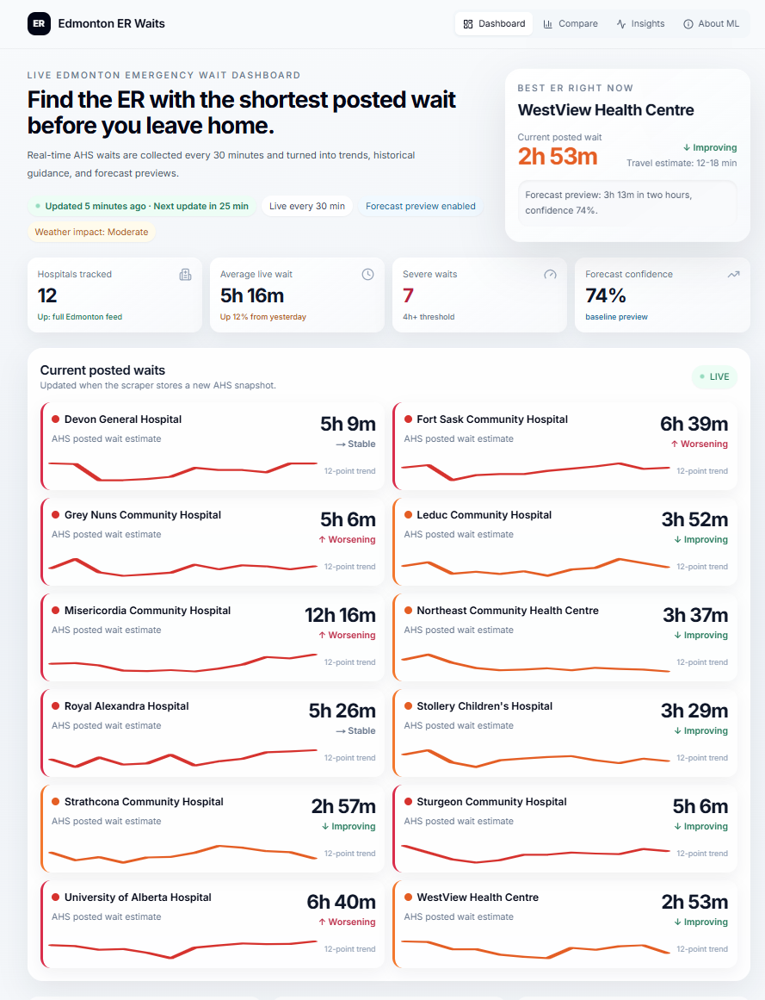
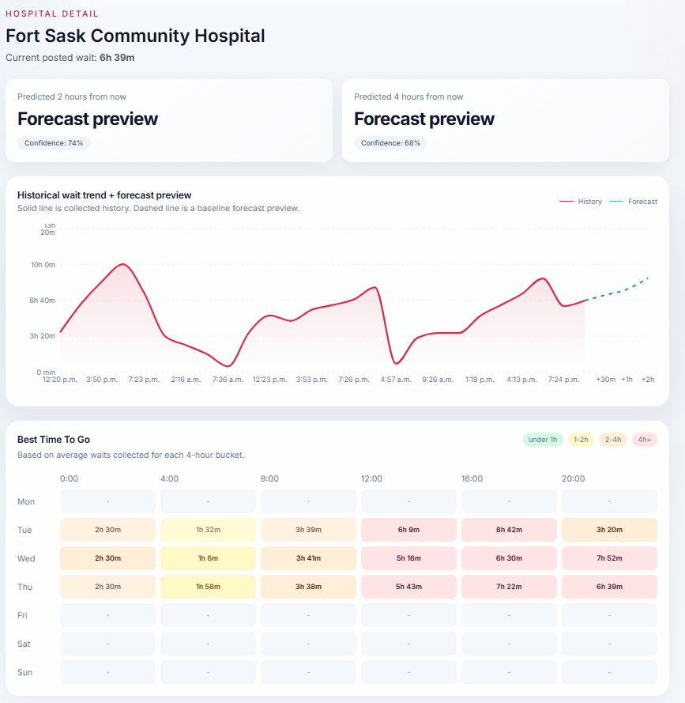
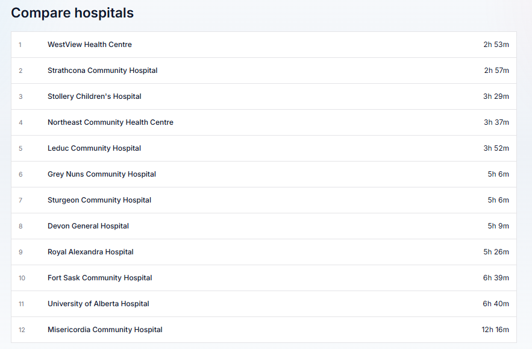
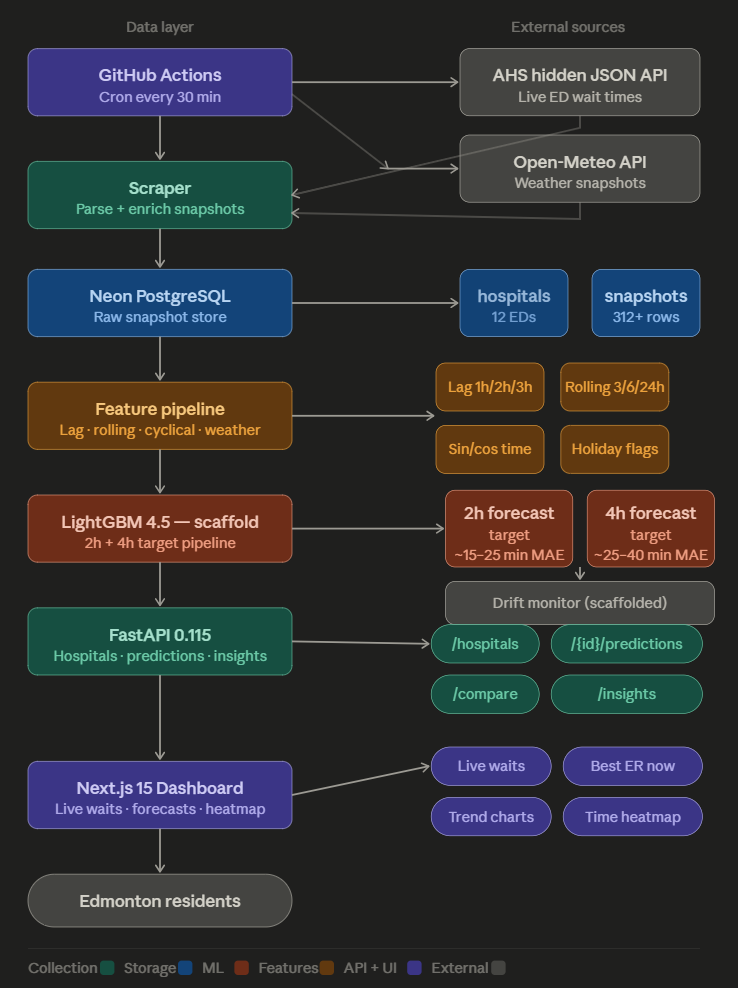

# Edmonton ER Wait Time Predictor
 
> A full-stack ML system that scrapes live AHS emergency department data every 30 minutes, builds a private historical dataset, and serves real-time wait time intelligence across 12 Edmonton hospitals — with 2-hour and 4-hour ML forecast previews powered by LightGBM.
 
[](https://python.org)
[](https://fastapi.tiangolo.com)
[](https://nextjs.org)
[](https://lightgbm.readthedocs.io)
[](https://neon.tech)
[](https://github.com/features/actions)
[](#data-collection)
 
---
 
## What This Does
 
Edmonton emergency rooms post estimated wait times publicly through AHS. This project turns that public data into something actually useful:
 
- **Scrapes all 12 Edmonton-area EDs every 30 minutes** via GitHub Actions, building a private historical dataset that AHS doesn't provide
- **Recommends the best ER right now** based on live wait times + travel estimate
- **Shows wait history and trend sparklines** per hospital so you can see if a wait is improving or worsening
- **Forecasts 2h and 4h ahead** using a LightGBM model trained on lag features, rolling averages, weather, and cyclical time encoding
- **Heatmaps the best times to visit** each hospital by day-of-week and 4-hour window from collected averages
- **Flags weather impact** on current system load
This isn't a toy dataset project. The scraper runs unattended in production, the database is live, and the dataset grows every 30 minutes.
 
---
 
## Dashboard Screenshots
 
<p align="center">
  
  <br/>
  <sub><b>Live Wait Dashboard</b> — 12 hospitals ranked by severity, with trend sparklines and the best ER recommendation updated every 30 minutes.</sub>
</p>
<br/>
<p align="center">
  
  <br/>
  <sub><b>Hospital Detail</b> — Historical wait trend with forecast preview, 2h/4h prediction confidence, and a day × time heatmap of best visit windows.</sub>
</p>
<br/>
<p align="center">
  
  <br/>
  <sub><b>Hospital Comparison</b> — All 12 Edmonton EDs ranked live by current posted wait time.</sub>
</p>
---
 
## Why I Built This
 
Alberta's ER wait times are public information — but only as a snapshot of right now. AHS doesn't publish historical data, trend analysis, or forecasts. Every 30 minutes, that snapshot is overwritten.
 
I built a system to capture every snapshot before it disappears, so that over time the dataset becomes genuinely useful: enough history to spot patterns, train a model, and give people actionable guidance before they walk out the door.
 
The problem is real. Edmonton ER waits regularly exceed 5–6 hours. Choosing the wrong hospital can cost you hours. If a model trained on historical patterns can reduce that decision uncertainty even slightly, it has real-world value.
 
This project also pushed me to solve engineering problems I hadn't faced before: running a scraper against a hidden JSON API (not the visible HTML), keeping unattended GitHub Actions pipelines stable, and building feature pipelines on top of a live growing dataset.
 
---
 
## Dataset (Live & Growing)
 
| Metric | Value |
|---|---|
| Hospitals tracked | **12 Edmonton-area EDs** |
| Collection frequency | **Every 30 minutes** |
| Collection start | **May 12, 2026** |
| Snapshots collected | **312+** (growing) |
| Weather source | Open-Meteo API |
| Storage | Neon PostgreSQL (cloud) |
 
The dataset does not exist anywhere else. AHS overwrites its snapshot on every page load. This project is the only source of structured historical wait time data for Edmonton EDs.
 
---
 
## ML Model — LightGBM Forecaster
 
> **Status:** Pipeline scaffolded and feature-complete. Model will be trained once sufficient historical data has accumulated (~2–4 weeks of 30-minute snapshots).
 
### Feature Engineering
 
| Feature Group | Details |
|---|---|
| Lag features | Wait times at −1h, −2h, −3h |
| Rolling averages | 3h, 6h, 24h windows |
| Cyclical time encoding | Hour, day-of-week, month → sin/cos |
| Weather join | Nearest weather snapshot by timestamp |
| Holiday flags | Canadian statutory holidays + days-to-holiday |
| Target horizons | +2h and +4h wait time prediction |
 
### Target Accuracy (post-training)
 
| Horizon | Target MAE |
|---|---|
| 2-hour forecast | ~15–25 minutes |
| 4-hour forecast | ~25–40 minutes |
 
 
---
 
## System Architecture

<p align="center">
  
</p>
 
---
 
## Engineering Highlights
 
**Discovering the hidden JSON API**
The AHS wait-time page looks like a static HTML table. It isn't. The actual data is loaded from a hidden internal JSON endpoint after page render. Scraping the visible HTML returned stale or empty data. I used browser DevTools to identify the real API call, then hit that endpoint directly — bypassing the HTML entirely. This was the first real blocker and the most important fix.
 
**GitHub Actions as an unattended data pipeline**
The scraper needs to run every 30 minutes indefinitely without manual intervention. GitHub Actions with a Neon cloud database handles this cleanly: each run applies the schema (idempotent), runs the scraper, and inserts the snapshot. A local Docker Postgres won't work here — Actions runs in ephemeral VMs with no persistent local state. Moving to Neon solved that entirely. The cron was tuned from `*/30` to `7,37 * * * *` after observing that GitHub's scheduler occasionally skips exact-minute boundaries.
 
**Feature pipeline on a live growing dataset**
The feature engineering layer doesn't know in advance how many snapshots exist. Lag and rolling features are computed relative to what's available — early runs produce NaN-heavy rows that the model ignores, while later runs produce fully-featured training samples. The pipeline handles this gracefully without crashing on sparse data.
 
**Heatmap from partial history**
The "Best Time To Go" heatmap aggregates average wait times by day-of-week × 4-hour bucket. The tricky part: days we haven't observed yet should appear blank, not zero. Days we have observed should show real averages even if we've only seen a few samples. Getting this distinction right required careful NULL handling and conditional rendering rather than defaulting empty cells.
 
**Stale data detection**
If the scraper misses a run (GitHub Actions delays, AHS API downtime), the dashboard shows a stale data warning rather than presenting old numbers as current. The frontend computes time-since-last-snapshot and surfaces it clearly.
 
**OneDrive / Next.js cache conflict**
Running the project on a Windows machine with OneDrive sync enabled caused repeated `readlink` errors in the `.next` build cache. OneDrive was intercepting Next.js's symlink operations. Solved by moving the project directory outside the OneDrive-monitored path.
 
---
 
## Tech Stack
 
| Layer | Technology |
|---|---|
| Data collection | Python 3.12, requests, BeautifulSoup |
| Scheduling | GitHub Actions (cron, every 30 min) |
| Weather API | Open-Meteo |
| Database | Neon PostgreSQL |
| Feature engineering | pandas 2.2.3, scikit-learn 1.5.2 |
| ML model | LightGBM 4.5.0 |
| Backend API | FastAPI 0.115.5, Pydantic v2, Uvicorn |
| Frontend | Next.js 15 (App Router), React 19 |
| Charts | Recharts |
| Icons | lucide-react |
| Deployment (planned) | Vercel (frontend) + Railway/Render (backend) |
 
## API Endpoints
 
| Method | Endpoint | Description |
|---|---|---|
| `GET` | `/api/hospitals` | All hospitals with current wait times |
| `GET` | `/api/hospitals/{id}` | Hospital detail with history |
| `GET` | `/api/predictions/{id}` | 2h and 4h forecasts for a hospital |
| `GET` | `/api/compare` | Ranked hospital comparison |
| `GET` | `/api/insights` | System-wide load and weather impact |
| `GET` | `/health` | Backend health check |
 
---
 
## Run Locally
 
**Prerequisites:** Python 3.11+, Node.js 18+, Docker (optional for local Postgres)
 
### 1 — Clone and configure
 
```bash
git clone https://github.com/jagjotbrar13/alberta-er-waits.git
cd alberta-er-waits
```
 
### 2 — Start database and services
 
```bash
docker compose up -d postgres redis
python scripts/apply_migrations.py
python scripts/seed_hospitals.py
```
 
Or point `DATABASE_URL` at a [Neon](https://neon.tech) cloud database instead.
 
### 3 — Start the API
 
```bash
pip install -r requirements.txt
uvicorn api.main:app --reload
# API: http://localhost:8000
# Docs: http://localhost:8000/docs
```
 
### 4 — Start the dashboard
 
```bash
cd frontend
npm install
npm run dev
# App: http://localhost:3000
```
 
---
 
## Unattended Data Collection (GitHub Actions)
 
To run the scraper in production without a local machine:
 
1. Create a [Neon](https://neon.tech) PostgreSQL database (free tier works)
2. Add the pooled connection string as a GitHub Actions secret named `DATABASE_URL`
3. Push to GitHub — the workflow applies the schema and scrapes every 30 minutes automatically
The scraper will run indefinitely, building the historical dataset that powers the ML model.
 
## Disclaimer
 
This project scrapes publicly available Alberta Health Services data for research and educational purposes. It is not affiliated with or endorsed by AHS. Wait times displayed are sourced directly from AHS public feeds and may not reflect actual clinical conditions. Always call ahead or use official AHS channels for urgent medical decisions.